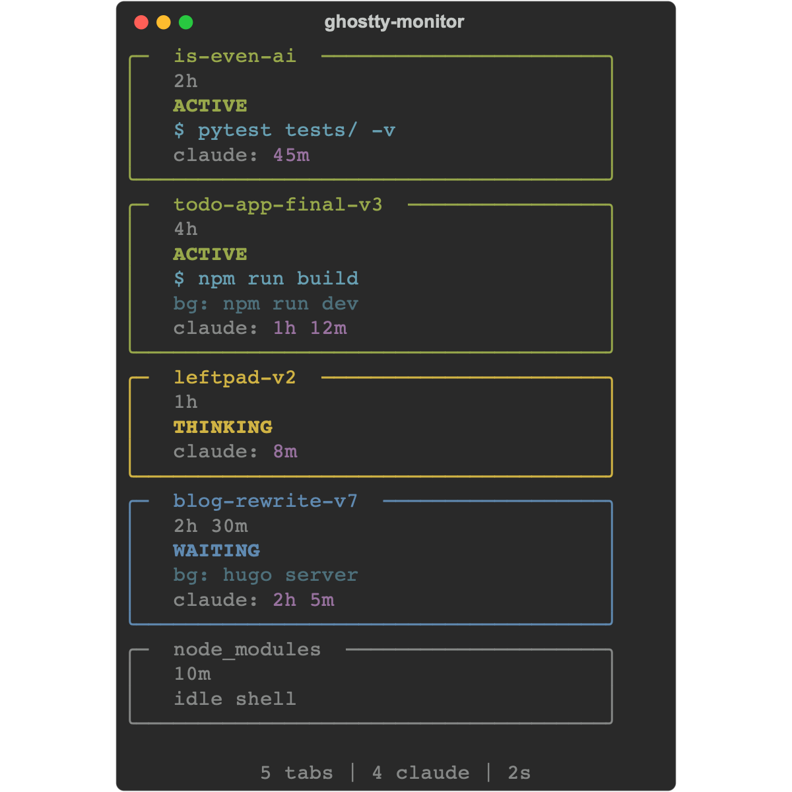

# monitor-de-claudios

A terminal dashboard that shows what all your Claude Code sessions are doing across Ghostty tabs.



## What is this

If you run Claude Code in multiple Ghostty tabs, this gives you a live overview of each session: which ones are actively running commands, which are thinking, and which are waiting for input. Useful for keeping track of parallel agents without constantly switching tabs.

## Status detection

The monitor walks the macOS process tree every 2 seconds and classifies each Claude session by looking at two signals: whether `caffeinate` is running (Claude spawns this while working) and whether any `shell-snapshot` processes exist (how Claude's Bash tool executes commands).

| caffeinate | shell-snapshot | Status | Meaning |
|---|---|---|---|
| yes | yes | **ACTIVE** (green) | Running a bash command |
| yes | no | **THINKING** (yellow) | API call or internal tool (Read/Edit/Grep) |
| no | yes | **WAITING** (blue) | At prompt; shell-snapshots are background servers |
| no | no | **WAITING** (blue) | At prompt, idle |

Tabs without a Claude session show as **idle shell** (dim).

## Requirements

- Python 3
- [`rich`](https://github.com/Textualize/rich)
- macOS (uses `ps` and `lsof`)
- [Ghostty](https://ghostty.org) terminal

## Usage

```
pip install rich
python ghostty_monitor.py
```

Run it in a separate Ghostty tab or a different terminal. It refreshes every 2 seconds. `Ctrl-C` to quit.

## How it works

1. Finds the main Ghostty process (the one with `ppid=1`)
2. Walks down to each tab's login shell via `login → zsh`
3. Checks if a `claude` process is running under each shell
4. Classifies each Claude session by inspecting its child processes
5. Fetches working directories via `lsof` to name each tab
6. Renders everything as Rich panels sorted by activity

Background processes (like `npm run dev` started via `run_in_background`) are detected and shown separately without affecting the status.

## License

[Unlicense](LICENSE) — public domain.
